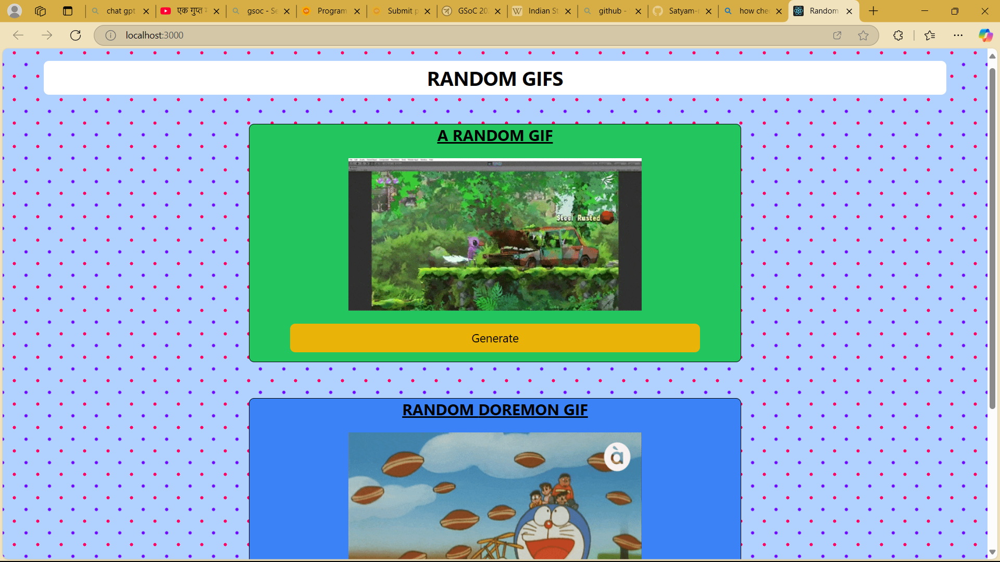

# 🎲 Random GIF Generator

A fun and interactive React app that fetches GIFs from the GIPHY API.

🌀 The app has **two main sections**:
1. **Random GIF Generator** – Click a button to see a totally random GIF.
2. **Search GIF by Tag** – Type in a keyword (like "Doremon") and get a GIF matching that theme.

---

## 📸 Project Preview

### 🧩 Full App View


---

## 🛠️ Tech Stack

- ⚛️ **React**
- 🎨 **Tailwind CSS**

---

## 📁 Folder Structure

```
src/
├── components/
│   ├── Random.js      // Random GIF generator component
│   ├── Spiner.js      // Spinner/Loader
│   └── Tag.js         // Tag-based GIF component
├── hooks/             // Custom hooks (if any)
├── App.jsx            // Main app component
├── index.js           // Entry point
├── index.css          // Global styles
tailwind.config.js     // Tailwind CSS config
```

---

## 🚀 How to Run Locally

1. Clone the repo
```bash
git clone https://github.com/your-username/random-gif-generator.git
cd RandomGif
```

2. Install dependencies
```bash
npm install
```

3. Start the development server
```bash
npm start
```

4. Visit `http://localhost:3000` in your browser

---

## 🌐 API Used

This app uses the [GIPHY API](https://developers.giphy.com/) for fetching random and tag-based GIFs.

---

## ✨ Features

- 🔁 Random GIFs at the click of a button
- 🔍 Search GIFs by tag
- ⏳ Loader animation while fetching
- 📱 Responsive design
- 🎯 Clean & minimal UI

---

## 🔮 Future Improvements

- Add copy/download/share GIF feature
- Implement dark mode
- Add trending/sticker tabs

---

## 📄 License

MIT License

---

## 🙌 Acknowledgements

- Thanks to [GIPHY](https://giphy.com/) for the awesome API!
- Project built as a part of React learning journey ❤️


*Created with ❤️ by [Satyam](https://github.com/Satyam-nitp).*